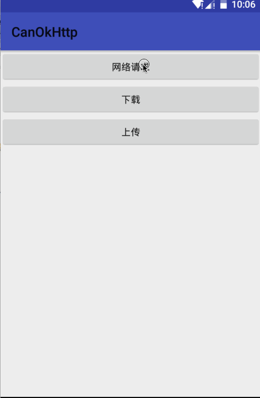

# CanOkHttp

 更方便地使用OkHttp。
 
   

##添加依赖
```JAVA
compile 'com.canyinghao:canokhttp:1.0.6'
```

## 使用方式 
**1. 使用方法**  
CanOkHttp是一个基于OkHttp的工具库。主要功能，带有缓存的网络请求、上传、下载。缓存没有使用OkHttp自带的缓存功能，而是自己实现的。缓存的类型有：1.仅网络请求（NETWORK）2.仅请求一次，直到缓存失效，读取缓存（CACHE）3.请求成功存cache4.请求网络失败后读缓存（NETWORK_CACHE）5.读缓存后请求网络（CACHE_NETWORK）6.缓存不请求网络的时间之内仅读缓存，过期请求网络（CACHETIME_NETWORK）7.缓存不请求网络的时间之内仅读缓存，过期请求网络，请求失败读取缓存（CACHETIME_NETWORK_CACHE）  

如缓存存活时间180s，缓存不请求网络时间60s。那么，180s后，缓存失效。使用CACHETIME_NETWORK与CACHETIME_NETWORK_CACHE时，刚请求过，60s内不请求网络，直接读取缓存。

日志使用的KLog，开关为KLog.init(true,"Canyinghao");

```JAVA

CanOkHttp.getInstance()

                        .add("app", "life.time")
                        .add("appkey", "10003")
                        .add("sign", "b59bc3ef6191eb9f747dd4e83c99f2a4")
                        .add("format", "json")
                        .add("cache", "CACHETIME_NETWORK_CACHE")
                        .url( url)
                        .setTag(this)
                        .setCacheSurvivalTime(180)
                        .setCacheNoHttpTime(60)
                        .setCacheType(CacheType.CACHETIME_NETWORK_CACHE)
                        .post()
                        .setCallBack(new CanSimpleCallBack() {

                            @Override
                            public void onCache(Object result) {


                                tvResult.setText(result.toString());
                            }

                            @Override
                            public void onResponse(Object result) {


                                tvResult.setText(result.toString());
                            }

                            @Override
                            public void onFailure(@ResultType int type, String e) {


                            }


                        });

``` 
**2. 注意事项**  
setConfig、setTag等在get或post方法前调用。setTag为activity后，可在BaseActivity中的onDestroy中调用CanCallManager.cancelCallByActivityDestroy(getClass())，在activity销毁时取消请求。
**3. 更新日志**  
2016.10.14  更新1.0.1

  
### 依赖库
```
 compile 'com.squareup.okhttp3:okhttp:3.4.1'
 compile 'com.github.zhaokaiqiang.klog:library:1.5.0'
 compile 'com.android.support:appcompat-v7:24.2.1'
```


### 开发者

 

canyinghao: 

<canyinghao@hotmail.com>  

[新浪微博](http://weibo.com/u/5670978460)

[google+](https://plus.google.com/u/0/109542533436298291853)


### License

    Copyright 2016 canyinghao

    Licensed under the Apache License, Version 2.0 (the "License");
    you may not use this file except in compliance with the License.
    You may obtain a copy of the License at

       http://www.apache.org/licenses/LICENSE-2.0

    Unless required by applicable law or agreed to in writing, software
    distributed under the License is distributed on an "AS IS" BASIS,
    WITHOUT WARRANTIES OR CONDITIONS OF ANY KIND, either express or implied.
    See the License for the specific language governing permissions and
    limitations under the License.

